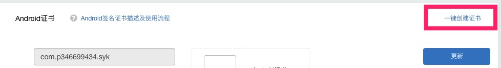
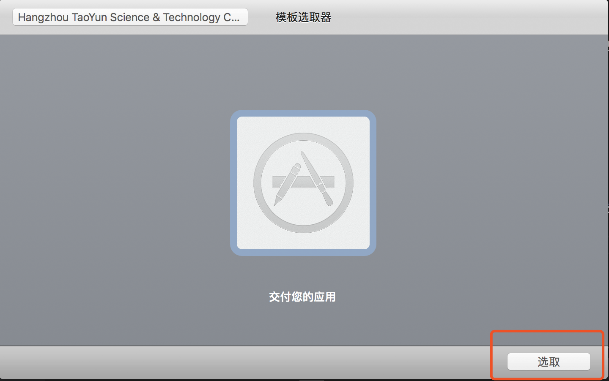
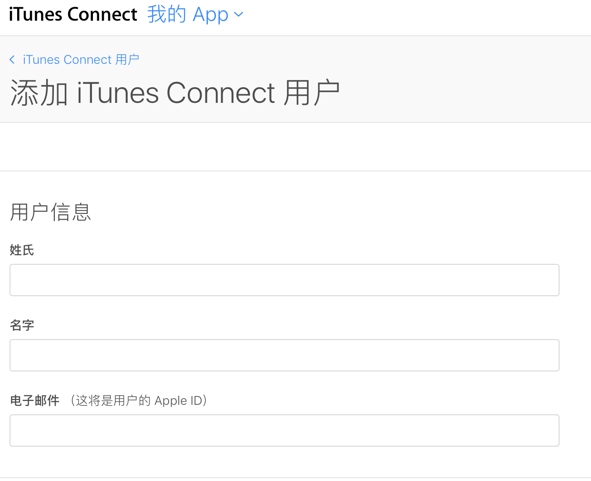
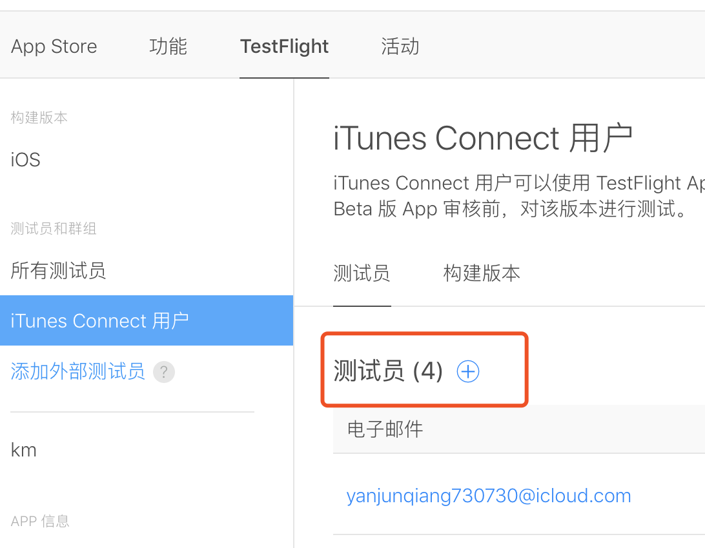

# app上架

通过[apicloud能够帮助](https://www.apicloud.com/certificate)我们快速上架app，节省很多中间环节。

## android一键上架

安卓点击`一键创建证书`就生成安卓证书, 之后再云编译生成.apk文件。

[在安卓微信里面分享会遇到一些问题，详情](/share.html)

## ios 

ios比较麻烦，过程比较多

### ios证书

按照文档先[创建证书](https://docs.apicloud.com/Dev-Guide/iOS-License-Application-Guidance)，只有创建证书才能安装app

### 打包.ipa

将证书上传到apicloud，则能云编译.ipa文件，下载到本地。

### 上传.ipa

本地打开application loader（可以安装xcode，集成了application loader），并登录。

选择之前下载的.ipa文件，之后会自动处理上传到iTunes。

### itunes connect

登录[itunes connect](https://itunesconnect.apple.com/WebObjects/iTunesConnect.woa/ra/ng/app/1380653871/ios/versioninfo), 处理之前上传的.ipa文件，添加**必要的信息**即可。

### 关于itunes里广告标识符 (IDFA)

解决方式：选**是**，选了后会出来4个子选项，选择**第2、3、4**项

### ios灰度测试

在测试环境测试完成之后，通过正式证书打包之后的.ipa文件，是无法安装的，通过testFlight来解决。

### itunes邀请用户

[添加内部用户](https://itunesconnect.apple.com/WebObjects/iTunesConnect.woa/ra/ng/users_roles)

这个时候邀请的用户就会收到邮件信息通知，之后点击信任等操作完成邀请。

### testFlight邀请

测试人员icloud邮箱收到testFlight邀请key，在手机上打开testFlight输入邀请key，就可以安装正式的.ipa。