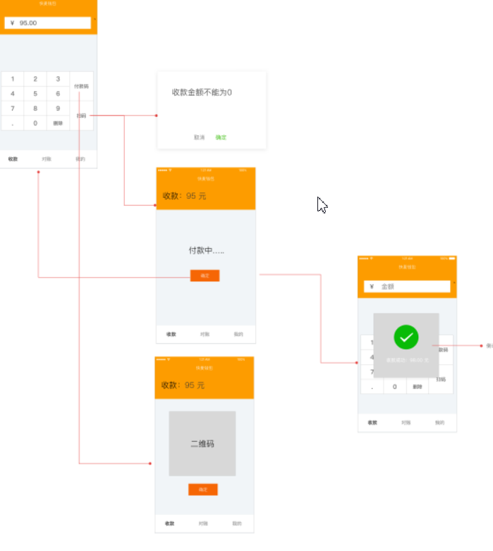
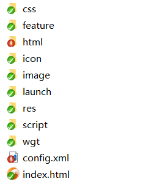

# 一周一App

新项目做个类似二维码扫码功能


## 需求

核心需求是要调用**摄像头**进行扫码，要支持语音播放，类似支付宝到账的声音。介于这2点，直接使用h5开发根本行不通了，必须使用端能力。

## apicloud

[apicloud](https://www.apicloud.com/)是快速构建混合开发的平台，开发者用前端技术，调用客户端api，并能够一键打包，不需要开发者关注端问题，不需要安装任何开发环境，直接用熟悉的代码编辑就可以开发。

## 为什么选择apicloud

1. 选择weex/rn平台，成本比较高，必须要有原生开发人员帮忙，不太现实。
2. apicloud够轻量，能够满足现有的需求，缺点是对于端的api，无法定制化。

## vue

[vue](https://cn.vuejs.org/), 轻量的mvvm库，配合[vant](https://www.youzanyun.com/zanui/vant#/zh-CN/intro), 非常适合构建移动端项目

## 项目构建

```bash
# 1. 先检查下 Node.js 是否安装成功

$ node -v
v10.0.0

$ npm -v
6.2.0

# 2. 由于众所周知的原因，可以考虑切换源为 taobao 源
$ npm set registry https://registry.npm.taobao.org/

# 3. 全局安装 vue-cli 一般是要 sudo 权限的
$ npm install --global vue-cli

# 4. 全局安装 apicloud-cli, 这个在客户端中调试页面需要用到
$ npm install --global apicloud-cli

# 5. 创建一个基于 vue_apicloud 模板的项目
$ vue init xiaoqiang730730/vue_apicloud my-project

# 6. 安装依赖，走你

$ cd my-project
$ npm install
$ npm run start

# 7. 打包构建

$ npm run package

```

## 与apicloud结合

关键点是如何将2者无缝的结合？这里面就涉及到apicloud的机制。

apicloud最核心的点，项目里面必须有config.xml。

看下官方的[默认模板](https://docs.apicloud.com/Dev-Guide/widget-package-structure-manual)



[配置信息](https://docs.apicloud.com/Dev-Guide/app-config-manual)
```xml
 <widget id="XXXX"  version="0.0.1">
    <name>快麦钱包</name>
    <description>
        快麦钱包
    </description>
    <author email="yanjunqiang@raycloud.com" href="http://www.raycloud.com">
        Developer
    </author>
    <content src="index.html" />
    <access origin="*" />
    <preference name="userAgent" value="https://lingshou.kuaimai.com"/>
    <preference name="pageBounce" value="false"/>
	<preference name="appBackground" value="rgb(255, 255, 255)"/>
	<preference name="windowBackground" value="rgb(255, 255, 255)"/>
	<preference name="frameBackgroundColor" value="rgb(255, 255, 255)"/>
	<preference name="hScrollBarEnabled" value="false"/>
	<preference name="vScrollBarEnabled" value="false"/>
	<preference name="autoLaunch" value="true"/>
	<preference name="fullScreen" value="false"/>
	<preference name="autoUpdate" value="true" />
	<preference name="smartUpdate" value="false" />
	<preference name="debug" value="true"/>
	<preference name="statusBarAppearance" value="true"/>
	<permission name="readPhoneState" />
	<permission name="camera" />
	<permission name="record" />
	<permission name="location" />
	<permission name="fileSystem" />
	<permission name="internet" />
	<permission name="bootCompleted" />
	<permission name="hardware" />
</widget>

```

**content** 是运行的起始页，支持相对/绝对路径。利用这一点，可以把content改成`http://xxxx:8080`, 就能够运行vue的项目了。

这里就能解释了新建项目之后里面会有一个`_apiConfig.xml`文件

## 新建apicloud项目

apicloud会默认帮用户新建初始模板，得通过svn去拉取代码，不合理，我们将摒弃这种方式。

在apicloud新建一个项目之后，，

apicloud会有一个id。

将`_apiConfig.xml`里面的id配置项，替换成新建项目的id。

## 自定义apicloud-loader

我们需要把vue的页面，放在apicloud容器里面。

先构建自定义loader，， 下载安装到手机或者模拟器。

## [apicloud-cli](https://docs.apicloud.com/Dev-Tools/apicloud-cli)

在安装自定义loader之后，按照如图所示，
这个时候就需求apicloud-cli了，2个步骤

wifi开启同步
`apicloud wifiStart --port 8686` 或者 `npm run wifistart`

wifi服务同步所有文件
`apicloud wifiSync --project ./src --updateAll true --port 8686` 或者 `npm run wifiupdateall`

这个时候就能在apicloud容器里面运行vue页面了。

注意了这个时候，我们项目是webpack构建的，同步的时候，会同步node_module，会卡爆了，所以需要有`.syncignore`文件用来忽略node_module。

[详细文档](https://docs.apicloud.com/Dev-Tools/apicloud-cli)

## 打包

在web页面写完之后，如何构建一个app呢，之前我们已经摈弃了传统的apicloud方式。

vue打包之后是在dist目录下，而apicloud可以使用上传文件形式。


我们可以将vue dist下的代码和config.xml一起打包成一个zip上传，这样就只要内部维护一个git了，有权限的人进行代码打包和上传。

[打包时候注意下 apicloud的格式是一个widget包裹的形式。](https://docs.apicloud.com/Dev-Guide/widget-package-structure-manual) 


封装了npm命令

`npm run package` 用来构建包。
