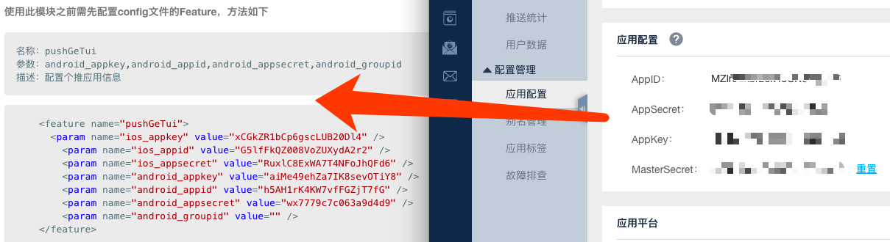
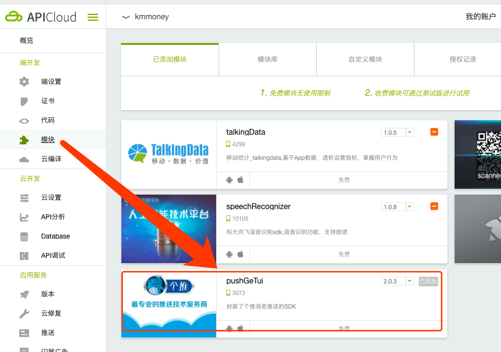
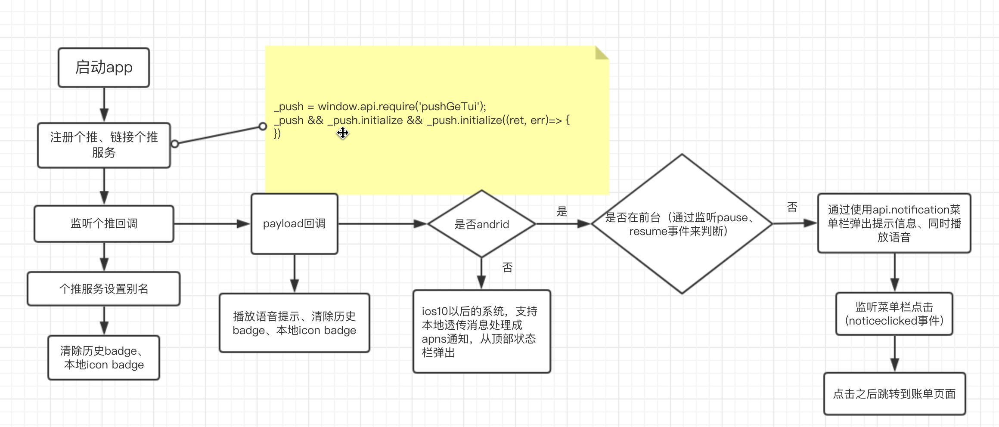

# app推送

app推送有很多提供商，这里我们先选择个推。主要使用apicloud的[pushGeTui模块](https://docs.apicloud.com/Client-API/Open-SDK/pushGeTui), [个推文档辅助](https://dev.getui.com/dos5.0/#/appList/dashboard/app)

## 个推配置

这里就用到apicloud里面的配置信息了，一般app生成正式之后，信息都不会变。

ios push证书，之前也有说明，照着文档做就好了。

## apicloud配置

我们app是通过apicloud来构建，那就是要涉及到在apicloud里面怎么使用个推的api了。

在config.xml里面配置好个推的信息，然后在代码里面`window.api.require('pushGeTui')`就可以正常使用个推模块了。

但是会发现这样设置之后，调试的时候，无法找到pushGeTui。那是因为我们自定义的loader没有包含个推。

在云端添加个推模块之后，重新生成下自定义loader就可以开发调试了。

## 消息类型

为了ios和Android都能使用，采用透传模式，否则我们得区分用户os类型。

## ios透传

ios10以后的系统，支持本地透传消息处理成apns通知，从顶部状态栏弹出。也就是说在app进入后台，ios会自动弹出状态栏信息，app在前台的时候，不会弹出状态栏信息。

## android透传

andriod就无法自动装换状态栏信息弹出了，就需要自己处理。

