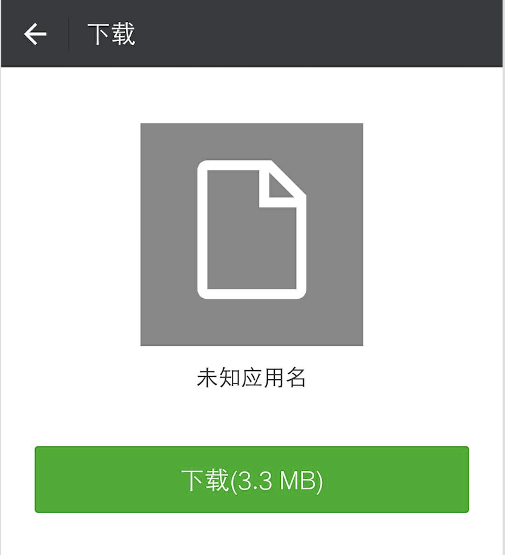
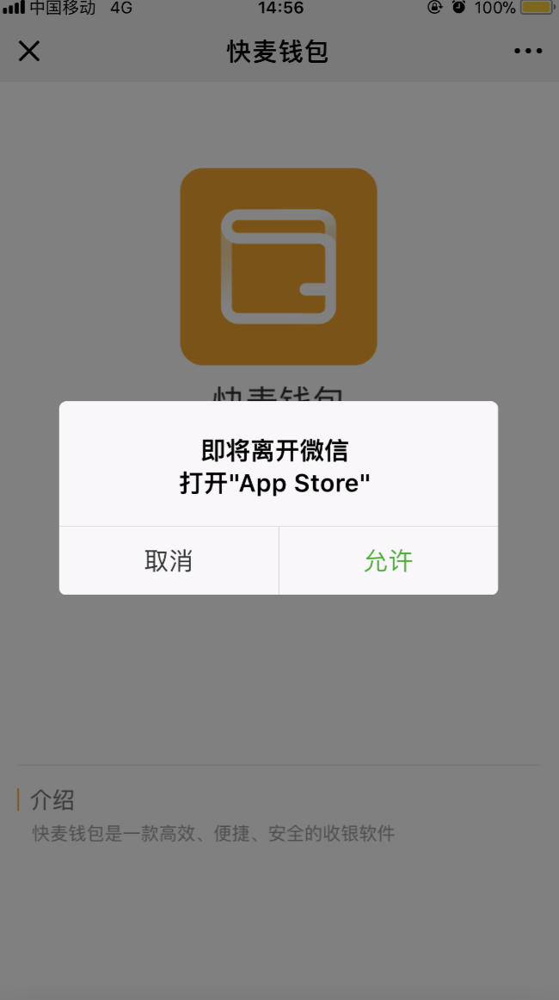

# 问题

在安卓微信上分享链接，由于链接是阿里云的[https://kmls.oss-cn-hangzhou.aliyuncs.com/Android/1.2.0.apk](https://kmls.oss-cn-hangzhou.aliyuncs.com/Android/1.2.0.apk), 用户在微信里面直接打开并不会直接下载，会变成如下



对于分享不是很好，用户就会有怀疑心态，不会轻易去下载。

# 解决方案1

将App上架应用宝，就可以在微信端里面分享了，但是应用宝上架需要[软著](http://apply.ccopyright.com.cn/cpcc/column_list_bqdj.jsp)，申请软著需要时间，从申请到通过大概得有2个多月呢。

# 解决方案2

既然用户无法直接下载应用，那就引导用户用浏览器打开页面，然后在浏览器里面下载app。

```js
// 利用ua里面的micromessenger字段来判断是否是微信环境
var isWeixin = ua.indexOf('micromessenger') != -1;
```

安卓微信引导用浏览器打开


ios微信直接跳转到app store


安卓浏览器直接下载，ios浏览器跳转app store。

[具体可以查看](https://static2.kuaimai.com/app.html)